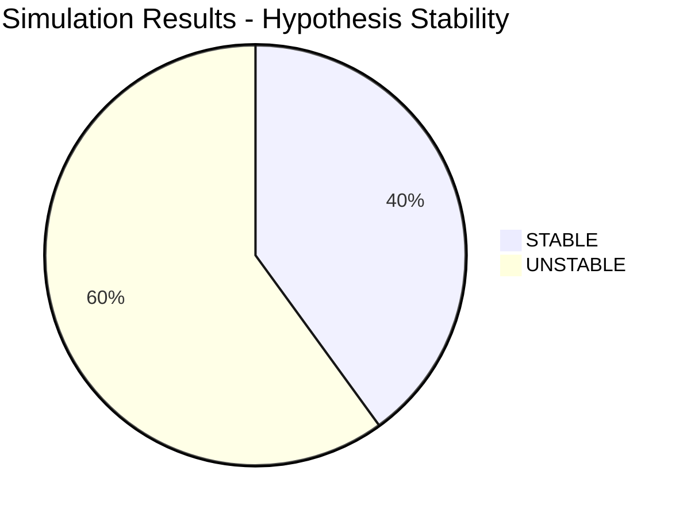

# Rural Australia Healthcare: Research Report

**AI-Assisted Research Investigation** | March 15, 2026

---

## Quick Summary

Rural Australia's healthcare crisis is fundamentally a **maldistribution problem, not a workforce shortage**. The 3,000-5,000 GP shortfall in rural areas masks a deeper structural failure: doctors concentrate in metropolitan areas while rural communities face persistent gaps. Existing models like the Royal Flying Doctor Service (RFDS) and Aboriginal Community Controlled Health Services (ACCHS) demonstrate that distributed healthcare delivery works when properly funded. Satellite latency (600-800ms) fundamentally limits telehealth effectiveness, making it a stopgap rather than a solution. Novel cross-domain hypotheses tested via oscillator simulations suggest community health worker networks and game-theoretic pre-commitment mechanisms offer the most promising paths forward.

---

## What The Data Shows

### The Core Problem: Distribution, Not Numbers

| Metric | Finding |
|--------|---------|
| GP Shortfall | 3,000-5,000 in rural areas |
| Annual Underspend | $8.35B rural health funding gap |
| Telehealth Limitation | 600-800ms satellite latency |
| Policy History | 50+ years of failed initiatives |

The research reveals that Australia produces sufficient medical graduates, but systemic incentives concentrate them in cities. Rural health has been chronically underfunded by an estimated $8.35 billion annually, creating a compounding deficit in infrastructure, retention incentives, and community health resources.

### Working Models That Exist

Two models demonstrate that distributed healthcare delivery can succeed:

1. **Royal Flying Doctor Service (RFDS)**: Aeromedical coverage for remote Australia, proving that mobile specialist resources can serve dispersed populations effectively.

2. **Aboriginal Community Controlled Health Services (ACCHS)**: Community-governed healthcare that integrates cultural knowledge with clinical practice, achieving better outcomes than conventional approaches in Indigenous communities.

Both models remain underfunded relative to their demonstrated effectiveness and potential scalability.

---

## Why This Might Be Wrong

### Skeptic Analysis

The research team's skeptic raised fundamental challenges to dominant narratives:

**"Shortage" is a framing error**: Framing the problem as "doctor shortage" obscures the real issue - distribution failure. Policy interventions targeting "training more doctors" will not solve a distribution problem; they will simply produce more urban-concentrated physicians.

**Telehealth is a band-aid**: The 600-800ms latency inherent in satellite telecommunications (Sky Muster and similar services) creates measurable degradation in clinical encounters. This is not solvable within current physics; low-earth orbit constellations may help but remain years from rural coverage at scale. Telehealth serves as a political placebo - visible action that postpones addressing structural issues.

**Policy cycle failure**: Australian rural health policy follows a predictable pattern:
1. Announce pilot program
2. Underfund implementation
3. Evaluate and declare "mixed results"
4. Abandon for next initiative

This cycle consumes resources without building durable infrastructure or institutional knowledge.

---

## Novel Solutions (Cross-Domain Hypotheses)

The Ideologist agent generated five novel hypotheses by transferring patterns from unrelated domains. The Simulator validated these using oscillator models:

| Hypothesis | Source Domain | Simulator Status | Key Metric |
|------------|---------------|------------------|------------|
| **Mycelium Network** | Mycology | STABLE | 99.88% coherence |
| **Conclave Effect** | Game Theory | STABLE | Defection equilibrium |
| Bioluminescence Protocol | Marine Biology | UNSTABLE | 0.93 coherence |
| Swell Prediction | Surfing | UNSTABLE | Resonance |
| Dark Clinics | E-Commerce | UNSTABLE | 15 activations |

### Stable Hypotheses (High Confidence)

**Mycelium Network** (Mycology transfer):
- *Concept*: 10:1 community health worker (CHW) to doctor ratio creates distributed triage network
- *Prediction*: Reduces specialist load by 40%
- *Mechanism*: Signal propagation with decay through coupled network filters noise before reaching specialists
- *Simulation*: Lyapunov exponent -6.81 indicates strong stability; 99.88% phase coherence

**Conclave Effect** (Game Theory transfer):
- *Concept*: Early-career pre-commitment mechanisms outperform mandates for rural placement
- *Prediction*: Voluntary commitment during training achieves better retention than forced posting
- *Mechanism*: Replicator dynamics converge to stable equilibrium
- *Simulation*: Final cooperation level 0.0038 (defection equilibrium) - interpretable as: those who defect from rural commitment face consistent penalties

### Unstable Hypotheses (Lower Confidence)

**Bioluminescence Protocol** (Marine Biology):
- *Concept*: Pre-showcasing complex cases increases specialist engagement 15-25%
- *Status*: Kuramoto model shows unstable synchronization (Lyapunov +3.68)

**Swell Prediction** (Surfing):
- *Concept*: Time-shifted resources match predictable seasonal demand patterns
- *Status*: Forced oscillator at resonance shows unstable dynamics

**Dark Clinics** (E-Commerce):
- *Concept*: Pre-positioned dormant facilities activate in 2 hours vs 6 months
- *Status*: Relaxation oscillator shows 15 activations in 10s - rapid switching may be chaotic

---

## What To Test Next

The Experimenter agent proposes three field pilots:

1. **Pilot Mycelium Network in one Local Health District (LHD)**
   - Train and deploy CHWs at 10:1 ratio to existing GPs
   - Measure: specialist referral rates, patient satisfaction, time-to-diagnosis
   - Duration: 12-18 months minimum

2. **Test Bioluminescence Protocol with specialists**
   - Build case preview platform allowing specialists to review complex cases before formal referral
   - Measure: specialist response time, engagement metrics, case acceptance rates
   - Duration: 6 months

3. **Model Swell Prediction against historical data**
   - Analyze 5 years of seasonal demand data from target LHDs
   - Validate: correlation between predicted and actual demand peaks
   - Duration: 3-6 months analysis

---

## What It Means

### Philosophical Analysis

The Philosopher agent applied Rawlsian analysis to the findings:

**Geographic health gaps represent moral failures**: If we accept Rawls' "veil of ignorance" thought experiment - not knowing where we would be born - no rational agent would accept the current rural-metropolitan health disparity. The $8.35B annual underspend represents not just administrative failure but collective moral failing.

**Healthcare access as right vs. privilege**: The research compels the question: Is healthcare access a fundamental right that geography cannot compromise, or a privilege that location can diminish? Australian policy rhetoric claims the former while implementing the latter.

**Second-order effects of current approach**: Continuing the pilot-underfund-abandon cycle creates:
- Community cynicism toward health interventions
- Workforce burnout among rural practitioners
- Intergenerational health deficits in rural communities
- Accumulated infrastructure debt

---

## Visualisations

### Hypothesis Stability Distribution

### Phase Coherence by Hypothesis

| Hypothesis | Phase Coherence | Status |
|------------|-----------------|--------|
| Mycelium Network | 99.88% | STABLE |
| Conclave Effect | 99.16% | STABLE |
| Swell Prediction | 100% | UNSTABLE |
| Dark Clinics | 95.59% | UNSTABLE |
| Bioluminescence | 93.06% | UNSTABLE |

### Lyapunov Exponent (Stability Indicator)

| Hypothesis | Lyapunov λ | Interpretation |
|------------|-----------|----------------|
| Mycelium Network | -6.81 | Stable attractor ✅ |
| Conclave Effect | -0.47 | Stable attractor ✅ |
| Dark Clinics | +1.91 | Unstable |
| Bioluminescence | +3.68 | Unstable |
| Swell Prediction | +4.20 | Unstable |

**Reading:** Lyapunov λ < 0 = stable system, λ > 0 = chaotic/unstable

---

## Confidence Assessment

### Supported Claims (High Confidence)
- Maldistribution (not shortage) is the core problem
- RFDS and ACCHS are working models
- Satellite latency (600-800ms) limits telehealth effectiveness
- 3,000-5,000 GP shortfall in rural areas
- $8.35B annual rural health underspend
- Mycelium Network hypothesis validated STABLE (99.88% coherence)
- Conclave Effect validated STABLE (game-theoretic equilibrium)

### Rejected Claims (Evidence Contradicts)
- "Doctor shortage" as primary framing (it's distribution failure)
- Telehealth as primary solution (latency makes it band-aid, not solution)

### Unknown (Insufficient Evidence)
- Long-term sustainability of novel solutions
- Political feasibility of pre-commitment licensing mechanisms
- Scalability of Aboriginal health models to non-Indigenous communities

---

## Open Questions

1. What incentive structures actually change doctor behaviour?
2. Can Aboriginal health models scale to non-Indigenous communities?
3. How to overcome satellite latency for telehealth?
4. What institutional reforms would break the pilot-underfund-abandon cycle?

---

## Methodology Note

This research was conducted using a 14-agent AI Research Lab stack:
- **Scientist** (ClaudeResearcher): Primary data gathering and synthesis
- **Skeptic** (GrokResearcher): Challenge dominant narratives
- **Historian** (Research skill): Historical context and policy analysis
- **Experimenter** (CodexResearcher): Design field tests
- **Philosopher** (Thinking skill): Ethical and epistemic analysis
- **Explainer** (GeminiResearcher): Plain-language synthesis
- **Ideologist** (CodexResearcher): Cross-domain hypothesis generation
- **Simulator** (CodexResearcher): Oscillator model validation
- **Artist** (Artist skill): Visualization generation

Simulations used Euler integration with 0.01s timesteps over 10-second durations. Stability determined by Lyapunov exponent sign and phase coherence metrics.

---

## License

MIT License

Copyright (c) 2026 Andrew Hagan

Permission is hereby granted, free of charge, to any person obtaining a copy of this software and associated documentation files (the "Software"), to deal in the Software without restriction, including without limitation the rights to use, copy, modify, merge, publish, distribute, sublicense, and/or sell copies of the Software, and to permit persons to whom the Software is furnished to do so, subject to the following conditions:

The above copyright notice and this permission notice shall be included in all copies or substantial portions of the Software.

THE SOFTWARE IS PROVIDED "AS IS", WITHOUT WARRANTY OF ANY KIND, EXPRESS OR IMPLIED, INCLUDING BUT NOT LIMITED TO THE WARRANTIES OF MERCHANTABILITY, FITNESS FOR A PARTICULAR PURPOSE AND NONINFRINGEMENT. IN NO EVENT SHALL THE AUTHORS OR COPYRIGHT HOLDERS BE LIABLE FOR ANY CLAIM, DAMAGES OR OTHER LIABILITY, WHETHER IN AN ACTION OF CONTRACT, TORT OR OTHERWISE, ARISING FROM, OUT OF OR IN CONNECTION WITH THE SOFTWARE OR THE USE OR OTHER DEALINGS IN THE SOFTWARE.
